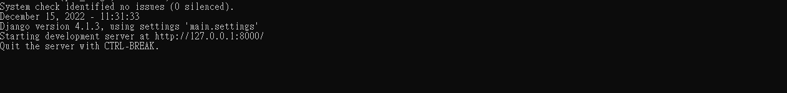
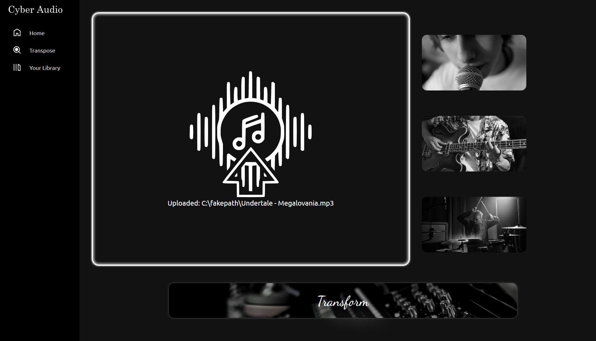
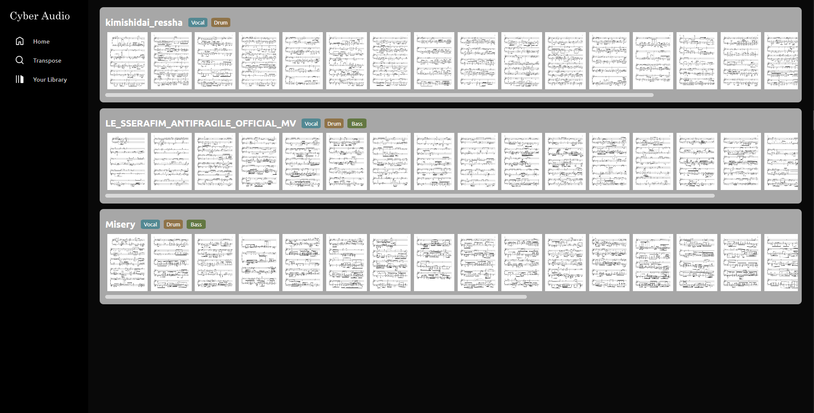

# CyberAudio Service

## Introduction

#### CyberAudio
Software to decomposing music into its constitutive components and transcript the corresponding instruments to the form of music notation. [Figma Design Document Link](https://www.figma.com/file/T3AqYIq5VHRMvfP1KtvFqI/CyberAudio)

#### Structure

```
│  db.sqlite3
│  manage.py
│  requirements.txt
│  tree.txt
├─media
│  │  library.html
│  └─data
│      └─{*music*}
│          │  library-show.html
│          │  {*music*}.mp3
│          ├─conf
│          ├─midi
│          ├─separate
│          └─sheet
├─static
│  ├─asset
│  ├─css
│  ├─html
│  │      home.html
│  │      library-show.html
│  │      library.html
│  │      transpose.html
│  └─source
│          jquery-3.6.1.js
├─template
│      index.html
│      library-show.html
│      library.html
├─event_handler
├─index
├─library_render
├─main
├─midi2sheet
├─runconvert
├─transpose
└─umx
```

## Install
1. <a name="install_cyberaudio"></a>Install CyberAudio
	1. Clone this repo.
	2. Move to this repo's directory.
	3. Install dependency with `pip install -r requirements.txt`
	4. Open cmd and execute `python manage.py runserver`
	5. Check run success or not.
2. <a name="install_musescore"></a>Install musescore 3
	1. Move to `https://musescore.org/`
	2. Download and install the software.
	3. Copy `bin` path with install directory (Default: `C:/Program Files/MuseScore 3/bin`) 
	4.  Paste to `tool_dir` in the file `$(repo_dir)/midi2sheet/conf/midi2sheet_config.json`
## API Document
1. Execute `python manage.py runserver`, 
2. Direct to `localhost:8000/redoc/`


## Workflow

### What you should check before use CyberAudio
1. [Server is running.](#install_cyberaudio)
	- 
2. [Musescore 3 setting is done.](#install_musescore)

### Home page


1. Click `START NOW` would guide to Transpose page.

2. Default Landing page.

### Transpose page

#### 1. Upload Audio file



#### 2. Select component which wants to transform


### 3. Click transform button.
### 4. Until It turn to Done, transcript task is completed.


### Your Library
Here to show the result of transcription

### Library Detail
